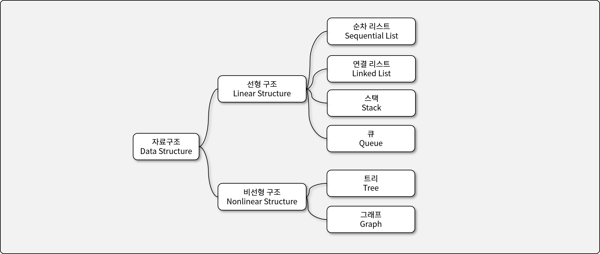

# Data Structures

## 학습 목표

- 자료구조란 무엇인지 학습한다.
- 자료구조를 왜 알아야 하는지 이해한다.
- JavaScript에 구현된 자료구조를 알아본다.

## 자료구조란

### 자료구조의 정의

- 자료(Data): 현실 세계로부터 수집한 사실이나 개념의 값 또는 이들의 집합. 특정 용도로 사용하기 위해 처리/가공한 것을 정보(Information)이라 한다.
- 자료구조(Data Structure): 자료구조는 자료 값의 모임, 자료 간의 관계, 그리고 자료에 적용할 수 있는 함수나 명령을 의미한다.

### 자료구조의 특징

- 효율성(Efficiency)
- 추상화(Abstraction)
- 재사용성(Reusability)

### 자료구조의 종류

- 크게 선형 자료구조와 비선형 자료구조로 나누어 볼 수 있다.
- 이외에도 다양한 자료구조가 있으며, 주요 자료구조에 대해서 알아볼 것이다.

#### 선형 자료구조

- 선형 자료구조는 자료가 일자로 연결된 경우를 말한다.
- 선형으로 연결된 방법에 따라 분류할 수 있으며, Array와 Linked List 등을 기반으로 Stack, Queue 등을 만들어 사용한다.

#### 비선형 자료구조

- 선형으로 연결되지 않은 모든 자료 구조를 말한다.
- 비선형 구조를 가장 일반적으로 표현하는 자료구조를 Graph라 한다.
- Top Node와 Child Node들로 구성된 Tree 구조가 많이 사용된다.
