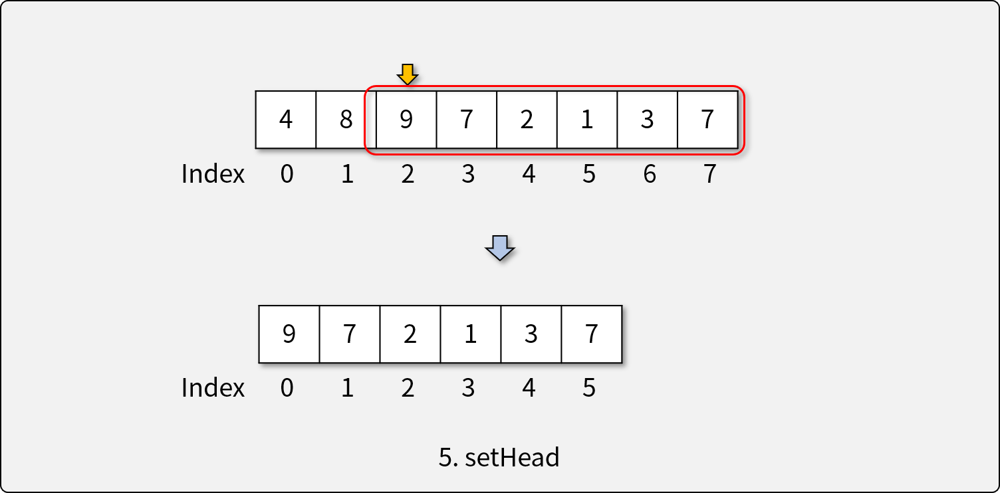
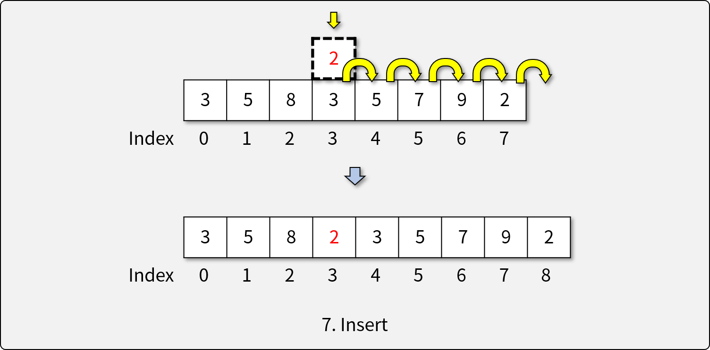

# 리스트 (Lists)

## 리스트란

- 순차적인 데이터(Sequential Data)를 다루기 위한 **추상 자료형**
- 리스트에는 동일한 값이 여럿 존재할 수 있으며, 이는 서로 다른 항목으로 구분된다.

## 리스트의 연산자 (Operators)

1. 비어있는 리스트를 생성하는 생성자

1. 리스트가 비어있는지 확인하는 연산자
1. 리스트의 앞에 개체를 삽입(prepending)하는 연산자

1. 리스트의 뒤에 개체를 삽입(appending)하는 연산자

1. 리스트의 첫 머리(head)를 결정하는 연산자

1. 주어진 인덱스에 해당하는 요소에 접근하는 연산자

1. 주어진 인덱스에 새로운 요소를 삽입하는 연산자

1. 주어진 인덱스에 해당하는 요소를 제거하는 연산자

## 리스트의 구현

- **배열 리스트 (Array List)**

  - 배열을 기반으로 만들어진 리스트
  - 가변 길이를 가지는 배열을 이용하여 리스트 구현
  - Array List에서 각 연산의 복잡도
    - `isEmpty()`: O(1)
    - `prepend()`: O(n)
    - `append()`: O(n) (조건부 O(1))
    - `setHead(index)`: O(1)
    - `access(index)`: O(1)
    - `insert(item, index)`: O(n)
    - `remove(index)`: O(n)
- **연결 리스트 (Linked List)**

  - 단방향(Singly Linked List) 또는 양방향(Doubly Linked List)
  - 각 요소는 값(Value)과 다음 요소를 *가르키는* 연결(Link)로 구성
  - 연결 리스트에서 각 연산의 복잡도
    - `isEmpty()`: O(n)
    - `prepend()`: O(1)
    - `append()`: O(n)
    - `setHead(index)`: O(n)
    - `access(index)` : O(n)
    - `insert(item, index)`: O(1) (w/o access)
    - `remove(index)`: O(1) (w/o access)

## JavaScript와 리스트

- JavaScript의 Array는 추상 자료형인 리스트를 구현한 **자료 구조**이다.
- Array에 구현된 리스트의 기능 (*`italic`*: trivial하게 구현 가능)
  - 비어있는 리스트를 생성하는 생성자 (`constructor`)
  - 리스트가 비어있는지 확인하는 연산자 (*`array.length`*)
  - 리스트의 앞에 개체를 삽입(prepending)하는 연산자 (`array.unshift`)
  - 리스트의 뒤에 개체를 삽입(appending)하는 연산자 (`array.push`)
  - 리스트의 첫 머리(head)를 결정하는 연산자 (*`array.slice`*; ~~O(1)~~ O(n))
  - 주어진 인덱스에 해당하는 요소에 접근하는 연산자 (`array[index]`)
  - 주어진 인덱스에 새로운 요소를 삽입하는 연산자 (*`array.slice` + `array.join`*)
  - 주어진 인덱스에 해당하는 요소를 제거하는 연산자 (*`array.splice`*)

## [실습] Array List 직접 구현하기

- **JavaScript의 TypedArray를 이용해 Array List 직접 구현하기**
- **구현 조건**
  - `class`와 `Int32Array`를 이용하여 Array List를 구현한다.
  - `Int32Array`의 용량(capacity)은 고정되어 있다고 가정한다.
    - 배열의 크기가 부족할 때 마다 2배 길이의 `Int32Array`를 새로 생성한다.
  - 다음과 같은 리스트 ADT의 연산자를 구현해야 한다.
    1. 비어있는 리스트를 생성하는 생성자
    1. 리스트가 비어있는지 확인하는 연산자
    1. 리스트의 앞에 개체를 삽입(prepending)하는 연산자
    1. 리스트의 뒤에 개체를 삽입(appending)하는 연산자
    1. 리스트의 첫 머리(head)를 결정하는 연산자
    1. 주어진 인덱스에 해당하는 요소에 접근하는 연산자
    1. 주어진 인덱스에 새로운 요소를 삽입하는 연산자
    1. 주어진 인덱스에 해당하는 요소를 제거하는 연산자
- **참조 코드**
  - [기반 소스 코드](src/before.js)
  - [솔루션 코드](src/after.js)
